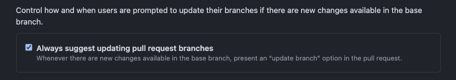
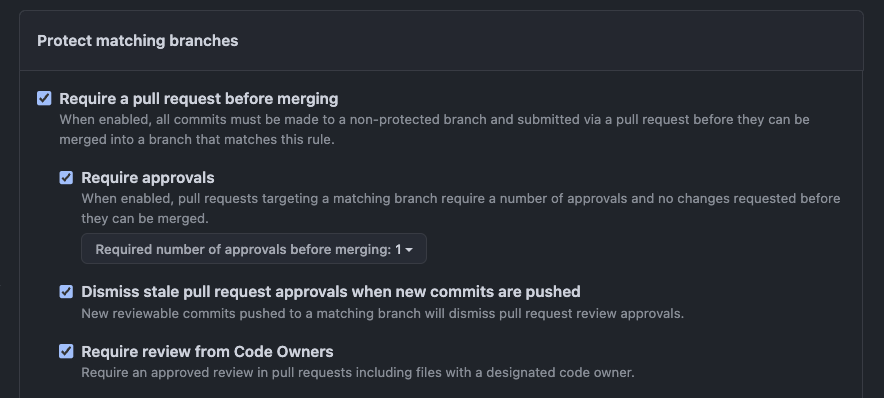
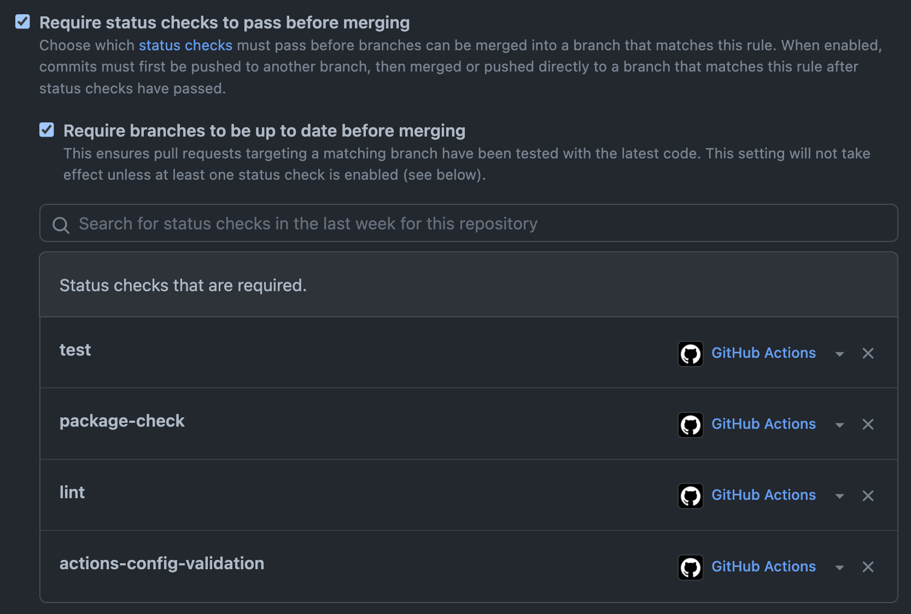

# Branch Deploy Action 🚀

[](https://github.com/github/branch-deploy/actions/workflows/codeql-analysis.yml) [](https://github.com/github/branch-deploy/actions/workflows/test.yml) [](https://github.com/github/branch-deploy/actions/workflows/package-check.yml) [](https://github.com/github/branch-deploy/actions/workflows/lint.yml) [](https://github.com/github/branch-deploy/actions/workflows/actions-config-validation.yml) [](./badges/coverage.svg)

A GitHub Action to enable branch deployments using IssueOps!


This Action does the heavy lifting for you to enable branch deployments:

- 🔍 Detects when IssueOps commands are used on a pull request
- ✏️ Configurable - Choose your command syntax, environment, noop trigger, base branch, reaction, and more
- ✔️ Respects your branch protection settings configured for the repo
- 🗨️ Comments and reacts to your IssueOps commands
- 🚀 Triggers GitHub deployments for you with simple configuration
- 🔓 Deploy locks to prevent multiple deployments from clashing

## Available Commands 💬

- `.deploy` - Deploy a pull request
- `.noop` - Deploy a pull request in noop mode. Noop deployments do not require a PR review or approval
- `.deploy to <environment>` - Deploy a pull request to a specific environment
- `.deploy <stable_branch>` - Trigger a rollback deploy to your stable branch (main, master, etc)
- `.lock` - Create a deployment lock for the default environment
- `.lock --reason <text>` - Create a deployment lock for the default environment with a custom reason
- `.lock --details` - View details about a deployment lock
- `.lock <environment>` - Create a deployment lock for a specific environment
- `.lock --global` - Create a global deployment lock
- `.unlock` - Remove a deployment lock
- `.unlock <environment>` - Remove a deployment lock for a specific environment
- `.unlock --global` - Remove a global deployment lock
- `.help` - Get help with IssueOps commands with this Action

> These commands are all fully customizable and are just an example using this Action's defaults

For the full command usage, check out the [usage document](docs/usage.md)

Alternate command syntax and shortcuts can be found at the bottom of this readme [here](#alternate-command-syntax)

## Demo 🎥

A video demo showing how IssueOps on a pull request works using this Action

<https://github.com/github/branch-deploy/assets/23362539/887cb1d3-e600-4d4c-ae0a-959b206e4513>

## Turbo Quickstart ⚡

A quick section to get you started with this Action

### Usage 📝

Basic usage assuming all defaults:

```yaml
- name: branch-deploy
  id: branch-deploy
  uses: github/branch-deploy@vX.X.X
```

Advanced usage with custom configuration:

```yaml
- name: branch-deploy
  id: branch-deploy
  uses: github/branch-deploy@vX.X.X
  with:
    trigger: ".deploy"
    noop_trigger: ".noop"
    reaction: "eyes"
    environment: "production"
    stable_branch: "main"
```

### Example 📚

Check out a super simple workflow example using this Action to quickly get up and running with branch deployments

```yaml
name: "branch deploy demo"

# The workflow to execute on is comments that are newly created
on:
  issue_comment:
    types: [created]

# Permissions needed for reacting and adding comments for IssueOps commands
permissions:
  pull-requests: write
  deployments: write
  contents: write
  checks: read
  statuses: read

jobs:
  demo:
    if: ${{ github.event.issue.pull_request }} # only run on pull request comments
    runs-on: ubuntu-latest
    steps:
      # Execute IssueOps branch deployment logic, hooray!
      # This will be used to "gate" all future steps below and conditionally trigger steps/deployments
      - uses: github/branch-deploy@vX.X.X
        id: branch-deploy
        with:
          trigger: ".deploy"

      # Run your deployment logic for your project here - examples seen below

      # Checkout your project's repository based on the commit SHA provided by the branch-deploy step
      # It is important to only ever operate on the commit SHA (where possible) as commit SHA's are immutable and you know exactly what you are deploying
      - uses: actions/checkout@v4
        with:
          ref: ${{ steps.branch-deploy.outputs.sha }}

      # Do some fake "noop" deployment logic here
      # conditionally run a noop deployment
      - name: fake noop deploy
        if: ${{ steps.branch-deploy.outputs.continue == 'true' && steps.branch-deploy.outputs.noop == 'true' }}
        run: echo "I am doing a fake noop deploy"

      # Do some fake "regular" deployment logic here
      # conditionally run a regular deployment
      - name: fake regular deploy
        if: ${{ steps.branch-deploy.outputs.continue == 'true' && steps.branch-deploy.outputs.noop != 'true' }}
        run: echo "I am doing a fake regular deploy"
```

> Keep reading to learn more about this Action! Even further details about how this Action works can be found below as well

You can check out further examples by checking out our [examples](docs/examples.md) documentation

## About 💡

Before we get into details, let's first define a few key terms below:

- **IssueOps** - Its like ChatOps but instead of using a chat bot, commands are invoked by commenting on a pull request (PRs are issues under the hood) - Example: commenting `.deploy` on a pull request
- **Branch Deployment** - A branch deploy is a deployment methodology that enables you to deploy a branch (or pull request) to a desired environment before merging to `main` or `master` - More on this below
- **PR** - Short for pull request

### IssueOps 🗨️

The best way to define IssueOps is to compare it to something similar, ChatOps. You may be familiar with the concept ChatOps already but in case you aren't here is a quick definition below:

> ChatOps is the process of interacting with a chat bot to execute commands directly in a chat platform. For example, with ChatOps you might do something like `.ping example.org` to check the status of a website

IssueOps adopts the same mindset but through a different medium. Rather than using a chat service to invoke the commands we use comments on a GitHub Issue or Pull Request. GitHub Actions is the runtime which executes our desired logic

### Branch Deployments 🌲

Branch deployments are a battle tested way of deploying your changes to a given environment for a variety of reasons. Branch deployments allow you to do the following:

- Deploy your changes to production **before** merging
- Deploy changes to a staging, QA, or non-production environment

#### Branch Deployment Core Concepts ⭐

> Note: The `main` branch is considered the base repository branch for all examples below

- The `main` branch is always considered to be a stable and deployable branch
- All changes are deployed to production before they are merged to the `main` branch
- To roll back a branch deployment, you deploy the `main` branch
- `noop` deployments should not make changes but rather report what they "would" have done and do not require approval or review before starting

#### Why use branch deployments?

> To put the *merge -> deploy* model in the past!

What if your changes are bad and you broke production with the *merge -> deploy* model? Well now you have to revert your PR, get passing CI/builds, and then re-merge your changes to get back to a stable environment. With the **branch deploy** model, this is almost never the case. The `main` branch is considered to be always safe and stable

## How does it work? 📚

> This section will go into detail about how this Action works and hopefully inspire you on ways you can leverage it in your own projects

Let's walk through a GitHub Action workflow using this Action line by line:

```yaml
# The name of the workflow, it can be anything you wish
name: "branch deploy demo"

# The workflow to execute on is comments that are newly created
on:
  issue_comment:
    types: [created]
```

It is important to note that the workflow we want to run IssueOps on is `issue_comment` and `created`. This means we will not run under any other contexts for this workflow. You can edit this as you wish but it does change how this model ultimately works. For example, `issue_comment` workflows **only** use files found on `main` to run. If you do something like `on: pull_request` you could open yourself up to issues as a user could alter a file in a PR and exfil your secrets for example. Only using `issue_comment` is the suggested workflow type

```yaml
# Permissions needed for reacting and adding comments for IssueOps commands
permissions:
  pull-requests: write # Required for commenting on PRs
  deployments: write # Required for updating deployment statuses
  contents: write # Required for reading/writing the lock file
  checks: read # Required for checking if the CI checks have passed in order to deploy the PR
  statuses: read # Required for checking if all commit statuses are "success" in order to deploy the PR
```

These are the minimum permissions you need to run this Action. If you need further assistance with permissions within GitHub Actions, please review the following [documentation](https://docs.github.com/en/actions/security-guides/automatic-token-authentication#permissions-for-the-github_token).

```yaml
jobs:
  demo:
    if: ${{ github.event.issue.pull_request }} # only run on pull request comments
    runs-on: ubuntu-latest
    steps:
      # Checkout your projects repository
      - uses: actions/checkout@v4
```

Sets up your `demo` job, uses an ubuntu runner, and checks out your repo - Just some standard setup for a general Action. We also add an `if:` statement here to only run this workflow on pull request comments to make it a little cleaner

> Note: The Action will check the context for us anyways but this can save us a bit of CI time by using the `if:` condition

```yaml
      # Execute IssueOps branch deployment logic, hooray!
      - uses: github/branch-deploy@vX.X.X
        id: branch-deploy
        with:
          trigger: ".deploy"
```

> Note: It is important to set an `id:` for this job so we can reference its outputs in subsequent steps

The core of this Action takes place here. This block of code will trigger the branch deploy action to run. It will do the following:

1. Check the comment which invoked the workflow for the `trigger:` phrase (`.deploy`) defined here
1. If the trigger phrase is found, it will proceed with a deployment
1. It will start by reacting to your message to let you know it is running
1. The Action will post a comment with a link to the running Actions workflow for you to follow its progress
1. A deployment will be started and attached to your pull request - You'll get a nice little yellow rocket which tells you a deployment is in progress
1. Outputs will be exported by this job for later reference in other jobs as well

```yaml
      # Do some fake "noop" deployment logic here
      # conditionally run a noop deployment
      - name: fake noop deploy
        if: ${{ steps.branch-deploy.outputs.continue == 'true' && steps.branch-deploy.outputs.noop == 'true' }}
        run: echo "I am doing a fake noop deploy"

      # Do some fake "regular" deployment logic here
      # conditionally run a regular deployment
      - name: fake regular deploy
        if: ${{ steps.branch-deploy.outputs.continue == 'true' && steps.branch-deploy.outputs.noop != 'true' }}
        run: echo "I am doing a fake regular deploy"
```

As seen above, we have two steps. One for a noop deploy, and one for a regular deploy. For example, the noop deploy could trigger a `terraform plan` and the regular deploy could be a `terraform apply`. These steps are conditionally gated by two variables:

- `steps.branch-deploy.outputs.continue == 'true'` - The `continue` variable is only set to true when a deployment should continue
- `steps.branch-deploy.outputs.noop == 'true'` - The `noop` variable is only set to true when a noop deployment should be run

> Example: You comment `.noop` on a pull request. A noop deployment is detected so this action outputs the `noop` variable to `true`. You also have the correct permissions to execute the IssueOps command so the action also outputs the `continue` variable to `true`. This will allow the "fake noop deploy" step seen above to run and the "fake regular deploy" step will be skipped

## Inputs 📥

| Input | Required? | Default | Description |
| ----- | --------- | ------- | ----------- |
| `github_token` | `true` | `${{ github.token }}` | The GitHub token used to create an authenticated client - Provided for you by default! |
| `status` | `true` | `${{ job.status }}` | The status of the GitHub Actions - For use in the post run workflow - Provided for you by default! |
| `reaction` | `false` | `eyes` | If set, the specified emoji "reaction" is put on the comment to indicate that the trigger was detected. For example, "rocket" or "eyes" |
| `trigger` | `false` | `.deploy` | The string to look for in comments as an IssueOps trigger. Example: ".deploy" |
| `noop_trigger` | `false` | `.noop` | The string to look for in comments as an IssueOps noop trigger. Example: ".noop" - The usage would then be ".noop" |
| `lock_trigger` | `false` | `.lock` | The string to look for in comments as an IssueOps lock trigger. Used for locking branch deployments on a specific branch. Example: ".lock" |
| `unlock_trigger` | `false` | `.unlock` | The string to look for in comments as an IssueOps unlock trigger. Used for unlocking branch deployments. Example: ".unlock" |
| `help_trigger` | `false` | `.help` | The string to look for in comments as an IssueOps help trigger. Example: ".help" |
| `lock_info_alias` | `false` | `.wcid` | An alias or shortcut to get details about the current lock (if it exists) Example: ".info" - Hubbers will find the ".wcid" default helpful ("where can I deploy") |
| `permissions` | `true` | `write,admin` | The allowed GitHub permissions an actor can have to invoke IssueOps commands - Example: "write,admin" |
| `commit_verification` | `false` | `"false"` | Whether or not to enforce commit verification before a deployment can continue. Default is `"false"`. This input option is excellent to enforce tighter security controls on your deployments. |
| `param_separator` | `false` | `\|` | The separator to use for parsing parameters in comments in deployment requests. Parameters will are saved as outputs and can be used in subsequent steps - See [Parameters](docs/parameters.md) for additional details |
| `global_lock_flag` | `false` | `--global` | The flag to pass into the lock command to lock all environments. Example: "--global" |
| `environment` | `false` | `production` | The name of the default environment to deploy to. Example: by default, if you type `.deploy`, it will assume "production" as the default environment |
| `environment_targets` | `false` | `production,development,staging` | Optional (or additional) target environments to select for use with deployments. Example, "production,development,staging". Example  usage: `.deploy to development`, `.deploy to production`, `.deploy to staging` |
| `environment_urls` | `false` | `""` | Optional target environment URLs to use with deployments. This input option is a mapping of environment names to URLs and the environment names **must** match the `environment_targets` input option. This option is a comma separated list with pipes (`\|`) separating the environment from the URL. Note: `disabled` is a special keyword to disable an environment url if you enable this option. Format: `"<environment1>\|<url1>,<environment2>\|<url2>,etc"` Example: `"production\|https://myapp.com,development\|https://dev.myapp.com,staging\|disabled"` - See the [environment urls](#environment-urls) section for more details |
| `draft_permitted_targets` | `false` | `""` | Optional environments which can allow "draft" pull requests to be deployed. By default, this input option is empty and no environments allow deployments sourced from a pull request in a "draft" state. Examples: `"development,staging"` |
| `environment_url_in_comment` | `false` | `"true"` | If the `environment_url` detected in the deployment should be appended to the successful deployment comment or not. Examples: `"true"` or `"false"` - See the [environment urls](#environment-urls) section for more details |
| `production_environments` | `false` | `production` | A comma separated list of environments that should be treated as "production". GitHub defines "production" as an environment that end users or systems interact with. Example: "production,production-eu". By default, GitHub will set the "production_environment" to "true" if the environment name is "production". This option allows you to override that behavior so you can use "prod", "prd", "main", "production-eu", etc. as your production environment name. ref: [#208](https://github.com/github/branch-deploy/issues/208) |
| `stable_branch` | `false` | `main` | The name of a stable branch to deploy to (rollbacks). Example: "main" |
| `update_branch` | `false` | `warn` | Determine how you want this Action to handle "out-of-date" branches. Available options: "disabled", "warn", "force". "disabled" means that the Action will not care if a branch is out-of-date. "warn" means that the Action will warn the user that a branch is out-of-date and exit without deploying. "force" means that the Action will force update the branch. Note: The "force" option is not recommended due to Actions not being able to re-run CI on commits originating from Actions itself |
| `outdated_mode` | `false` | `"strict"` | The mode to use for determining if a branch is up-to-date or not before allowing deployments. This option is closely related to the `update_branch` input option above. There are three available modes to choose from: `pr_base`, `default_branch`, or `strict`. The default is `strict` to help ensure that deployments are using the most up-to-date code. Please see the [documentation](docs/outdated_mode.md) for more details. |
| `required_contexts` | `false` | `"false"` | Manually enforce commit status checks before a deployment can continue. Only use this option if you wish to manually override the settings you have configured for your branch protection settings for your GitHub repository. Default is "false" - Example value: "context1,context2,context3" - In most cases you will not need to touch this option |
| `skip_ci` | `false` | `""` | A comma separated list of environments that will not use passing CI as a requirement for deployment. Use this option to explicitly bypass branch protection settings for a certain environment in your repository. Default is an empty string `""` - Example: `"development,staging"` |
| `checks` | `false` | `"all"` | This input defines how the branch-deploy Action will handle the status of CI checks on your PR/branch before deployments can continue. `"all"` requires that all CI checks must pass in order for a deployment to be triggered. `"required"` only waits for required CI checks to be passing. You can also pass in the names of your CI jobs in a comma separated list. View the [documentation](docs/checks.md) for more details. |
| `ignored_checks` | `false` | `""` | A comma separated list of checks that will be ignored when determining if a deployment can continue. This setting allows you to skip failing, pending, or incomplete checks regardless of the `checks` setting above. Example: `"lint,markdown-formatting,update-pr-label"`. View the [documentation](docs/checks.md) for more details. |
| `skip_reviews` | `false` | `""` | A comma separated list of environment that will not use reviews/approvals as a requirement for deployment. Use this options to explicitly bypass branch protection settings for a certain environment in your repository. Default is an empty string `""` - Example: `"development,staging"` |
| `allow_forks` | `false` | `"true"` | Allow branch deployments to run on repository forks. If you want to harden your workflows, this option can be set to false. Default is "true" |
| `admins` | `false` | `"false"` | A comma separated list of GitHub usernames or teams that should be considered admins by this Action. Admins can deploy pull requests without the need for branch protection approvals. Example: "monalisa,octocat,my-org/my-team" |
| `admins_pat` | `false` | `"false"` | A GitHub personal access token with "read:org" scopes. This is only needed if you are using the "admins" option with a GitHub org team. For example: "my-org/my-team" |
| `merge_deploy_mode` | `false` | `"false"` | Advanced configuration option for operations on merge commits. See the [merge commit docs](#merge-commit-workflow-strategy) below |
| `unlock_on_merge_mode` | `false` | `"false"` | Advanced configuration option for automatically releasing locks associated with a pull request when that pull request is merged. See the [unlock on merge mode](docs/unlock-on-merge.md) documentation for more details |
| `skip_completing` | `false` | `"false"` | If set to "true", skip the process of completing a deployment. You must manually create a deployment status after the deployment is complete. Default is "false" |
| `deploy_message_path` | `false` | `".github/deployment_message.md"` | The path to a markdown file which is used as a template for custom deployment messages. Example: `".github/deployment_message.md"` |
| `sticky_locks` | `false` | `"false"` | If set to `"true"`, locks will not be released after a deployment run completes. This applies to both successful, and failed deployments.Sticky locks are also known as ["hubot style deployment locks"](./docs/hubot-style-deployment-locks.md). They will persist until they are manually released by a user, or if you configure [another workflow with the "unlock on merge" mode](./docs/unlock-on-merge.md) to remove them automatically on PR merge. |
| `sticky_locks_for_noop` | `false` | `"false"` | If set to `"true"`, then sticky_locks will also be used for noop deployments. This can be useful in some cases but it often leads to locks being left behind when users test noop deployments. |
| `allow_sha_deployments` | `false` | `"false"` | If set to `"true"`, then you can deploy a specific sha instead of a branch. Example: `".deploy 1234567890abcdef1234567890abcdef12345678 to production"` - This is dangerous and potentially unsafe, [view the docs](docs/sha-deployments.md) to learn more |
| `disable_naked_commands` | `false` | `"false"` | If set to `"true"`, then naked commands will be disabled. Example: `.deploy` will not trigger a deployment. Instead, you must use `.deploy to production` to trigger a deployment. This is useful if you want to prevent accidental deployments from happening. View the [docs](docs/naked-commands.md) to learn more |
| `successful_deploy_labels` | `false` | `""` | A comma separated list of labels to add to the pull request when a deployment is successful. Example: `"deployed,success"` |
| `successful_noop_labels` | `false` | `""` | A comma separated list of labels to add to the pull request when a noop deployment is successful. Example: `"noop,success"` |
| `failed_deploy_labels` | `false` | `""` | A comma separated list of labels to add to the pull request when a deployment fails. Example: `"failed,deploy-failed"` |
| `failed_noop_labels` | `false` | `""` | A comma separated list of labels to add to the pull request when a noop deployment fails. Example: `"failed,noop-failed"` |
| `skip_successful_noop_labels_if_approved` | `false` | `"false"` | Whether or not the post run logic should skip adding successful noop labels if the pull request is approved. This can be useful if you add a label such as "ready-for-review" after a `.noop` completes but want to skip adding that label in situations where the pull request is already approved. |
| `skip_successful_deploy_labels_if_approved` | `false` | `"false"` | Whether or not the post run logic should skip adding successful deploy labels if the pull request is approved. This can be useful if you add a label such as "ready-for-review" after a `.deploy` completes but want to skip adding that label in situations where the pull request is already approved. |
| `enforced_deployment_order` | `false` | `""` | A comma separated list of environments that must be deployed in a specific order. Example: `"development,staging,production"`. If this is set then you cannot deploy to latter environments unless the former ones have a successful and active deployment on the latest commit first - See the [enforced deployment order docs](./docs/enforced-deployment-order.md) for more details |
| `use_security_warnings` | `false` | `"true"` | Whether or not to leave security related warnings in log messages during deployments. Default is `"true"` |
| `allow_non_default_target_branch_deployments` | `false` | `"false"` | Whether or not to allow deployments of pull requests that target a branch other than the default branch (aka stable branch) as their merge target. By default, this Action would reject the deployment of a branch named `feature-branch` if it was targeting `foo` instead of `main` (or whatever your default branch is). This option allows you to override that behavior and be able to deploy any branch in your repository regardless of the target branch. This option is potentially unsafe and should be used with caution as most default branches contain branch protection rules. Often times non-default branches do not contain these same branch protection rules. Follow along in this [issue thread](https://github.com/github/branch-deploy/issues/340) to learn more. |
| `deployment_confirmation` | `false` | `"false"` | Whether or not to require an additional confirmation before a deployment can continue. Default is `"false"`. If your project requires elevated security, it is highly recommended to enable this option - especially in open source projects where you might be deploying forks. |
| `deployment_confirmation_timeout` | `false` | `60` | The number of seconds to wait for a deployment confirmation before timing out. Default is `60` seconds (1 minute). |

## Outputs 📤

| Output | Description |
| ------ | ----------- |
| `continue` | The string "true" if the deployment should continue, otherwise empty - Use this to conditionally control if your deployment should proceed or not - ⭐ The main output you should watch for when determining if a deployment shall carry on |
| `fork` | The string "true" if the pull request is a fork, otherwise "false" |
| `triggered` | The string "true" if the trigger was found, otherwise the string "false" |
| `comment_body` | The comment body |
| `issue_number` | The issue number of the pull request (or issue) that was commented on |
| `actor` | The GitHub handle of the actor that invoked the IssueOps command |
| `environment` | The environment that has been selected for a deployment |
| `params` | The raw parameters that were passed into the deployment command (see param_separator) - Further [documentation](docs/parameters.md) |
| `parsed_params` | A stringified JSON object of the parsed parameters that were passed into the deployment command - Further [documentation](docs/parameters.md) |
| `noop` | The string "true" if the noop trigger was found, otherwise the string "false" - Use this to conditionally control whether your deployment runs as a noop or not |
| `sha` | The sha of the branch to be deployed |
| `default_branch_tree_sha` | The sha of the default branch tree (useful for subsequent workflow steps if they need to do commit comparisons) |
| `ref` | The ref (branch or sha) to use with deployment |
| `base_ref` | The base ref that the pull request is merging into |
| `comment_id` | The comment id which triggered this deployment |
| `deployment_id` | The ID of the deployment created by running this action |
| `environment_url` | The environment URL detected and used for the deployment (sourced from the environment_urls input) |
| `type` | The type of trigger that was detected (examples: deploy, lock, unlock, lock-info-alias, help) |
| `fork_ref` | The true ref of the fork |
| `fork_label` | The API label field returned for the fork |
| `fork_checkout` | The console command presented in the GitHub UI to checkout a given fork locally |
| `fork_full_name` | The full name of the fork in "org/repo" format |
| `initial_reaction_id` | The reaction id for the initial reaction on the trigger comment |
| `initial_comment_id` | The comment id for the "Deployment Triggered 🚀" comment created by the action |
| `actor_handle` | The handle of the user who triggered the action |
| `global_lock_claimed` | The string "true" if the global lock was claimed |
| `global_lock_released` | The string "true" if the global lock was released |
| `unlocked_environments` | Only exposed when using the "unlock on merge" mode - This output variable will contain a comma separated list of the environments that were unlocked - See the [unlock on merge mode](docs/unlock-on-merge.md) documentation for more details |
| `sha_deployment` | If `allow_sha_deployments` is enabled, and a sha deployment is performed instead of a branch deployment, this output variable will contain the sha that was deployed. Otherwise, this output variable will be empty |
| `review_decision` | The pull request review status. Can be one of a few values - examples: `APPROVED`, `REVIEW_REQUIRED`, `CHANGES_REQUESTED`, `skip_reviews`, `null` |
| `is_outdated` | The string `"true"` if the branch is out-of-date, otherwise `"false"` |
| `merge_state_status` | The status of the merge state. Can be one of a few values - examples: `"DIRTY"`, `"DRAFT"`, `"CLEAN"`, etc |
| `commit_status` | The status of the commit. Can be one of a few values - examples: `"SUCCESS"`, `null`, `"skip_ci"`, `"PENDING"`, `"FAILURE"` etc |
| `approved_reviews_count` | The number of approved reviews on the pull request |
| `needs_to_be_deployed` | A comma separated list of environments that need successful and active deployments before the current environment (that was requested) can be deployed. This output is tied to the `enforced_deployment_order` input option - See the [enforced deployment order docs](./docs/enforced-deployment-order.md) for more details |
| `commit_verified` | The string `"true"` if the commit is verified, otherwise `"false"` |
| `total_seconds` | The total number of seconds that the deployment took to complete (Integer) |
| `non_default_target_branch_used` | The string `"true"` if the pull request is targeting a branch other than the default branch (aka stable branch) for the merge, otherwise unset |

## Custom Deployment Messages ✏️

For documentation on how to customize the deployment messages, see the [custom deployment messages docs](./docs/custom-deployment-messages.md).

## About Environments 🌎

> If you are using environment rather than repo secrets, this section will be of interest to you

For those familiar with GitHub Actions, you have probably used environments before to store secrets and trigger deployments. The syntax for doing so is very simple and usually looks like this:

```yaml
jobs:
  deploy:
    environment: production # right here we use an environment
    runs-on: ubuntu-latest
    steps:
      - name: deployment
        run: terraform apply -auto-approve
```

However, this has a few limitations:

- When workflows finish, so does the deployment to that environment - This means that the little green rocket doesn't "stick" to your pull request
- It is tricky to tune in environment protection rules with a single environment when using IssueOps + branch-deployments

To get around these limitations with this branch-deploy action and IssueOps, we can use two different environments. One to store our environnement secrets and another to use in our branch deployments.

> Yes this isn't the most elegant solution, but it works and is very easy to accomplish

Here is a proper example for using two environments with this action:

```yaml
jobs:
  deploy:
    if: ${{ github.event.issue.pull_request }} # only run on pull request comments
    environment: production-secrets # custom environment for storing secrets
    runs-on: ubuntu-latest
    steps:
      - uses: github/branch-deploy@vX.X.X
        id: branch-deploy
        with:
          trigger: ".deploy"
          environment: production # the environment for the actual deployment

      # Your deployment steps go here...
```

This allows you to achieve the following:

- Fine grained control over your environment secrets in the `production-secrets` environment
- A "sticky" green rocket to your PR that doesn't disappear when the workflow finishes
- Access to all the environment secrets stored in the `production-secrets` environment

### Environment Targets

With this Action, you can also choose the environment you wish to deploy to. This is useful if you have multiple environments and want to deploy to a specific environment.

This can be achieved with the `environment_targets` input

With this option, you can specify a comma separated list of environments that you can deploy to besides just the default with `.deploy`

The defaults that are used are: [`production,development,staging`](https://github.com/github/branch-deploy/blob/e3cbb8f0137bfd7933492f12616c0cf91c7cf051/action.yml#L23). However, you can configure this to be whatever you like!

To use a deployment with a specific environment, you would invoke your commands like so:

- `.deploy production`
- `.deploy to production`
- `.deploy to <environment>`

This also works with noop commands as well

- `.noop production`
- `.noop to production`
- `.noop to <environment>`

YAML input example:

```yaml
- uses: github/branch-deploy@vX.X.X
  id: branch-deploy
  with:
    trigger: ".deploy"
    environment: production # the default environment
    environment_targets: "production,development,staging" # the environments that you can deploy to with explicit commands
```

You can view additional details about the `environment_targets` input option in the [`action.yml`](action.yml) section above

### Environment URLs

Environment URLs can be configured and mapped to matching `environment_targets` using the `environment_urls` input.

This input option is a mapping of environment names to URLs and the environment names **must** match the [`environment_targets`](https://github.com/github/branch-deploy#environment-targets) input option. This option is a comma separated list with pipes (`|`) separating the environment from the URL.

Note: `disabled` is a special keyword to disable an environment url if you enable this option but not all environments have a url.

Format: `"<environment1>|<url1>,<environment2>|<url2>,etc"`

Example: `"production|https://myapp.com,development|https://dev.myapp.com,staging|disabled"`

> This option is especially useful when your deployment targets are services with a URL (website, API, etc)

By enabling this option, you will get a "clickable" link on success (non-noop) deployment messages on pull requests. You will also be able to click the "View deployment" button in your repository's deployments page and be taken to the URL of the environment you deployed to.

If you wish to disable the "clickable" link on the successful deployment message, you can set the `environment_url_in_comment` input to `"false"`.

## Rollbacks 🔄

This Action supports rollback deployments out of the box. This is useful when you run a branch deployment (`.deploy`) and something goes wrong and you need to rollback to a previous known working state.

This can be achieved by using the `.deploy <stable_branch>` command

> See the [inputs](#inputs-) section above for more information on how to configure the stable branch

The `<stable_branch>` can be any branch you like but it is highly recommended that you use a branch that is protected and only has stable code in it. An example would be using `main` or `master` as your stable branch and enforcing strict branch protection rules on it to ensure that only stable code is merged into it

## Security 🔒

The IssueOps + branch-deploy model is significantly more secure than a traditional "deploy on merge" or "run on commit" model. Let's reference the workflow trigger that the branch-deploy model uses:

```yaml
on:
  issue_comment:
    types: [created]
```

Unlike the `on: pull_request` trigger, the `on: issue_comment` trigger only uses Actions workflow files from the default branch in GitHub. This means that a bad actor cannot open a PR with a malicious workflow edit and dump secrets, trigger bad deployments, or cause other issues. This means that any changes to the workflow files can be protected with branch protection rules to ensure only verified changes make it into your default branch.

To further harden your workflow files, it is strongly suggested to include the base permissions that this Action needs to run:

```yaml
permissions:
  pull-requests: write
  deployments: write
  contents: write
  checks: read
  statuses: read
```

Permissions Explained:

- `pull-requests`: `write` - Required to add comments to pull requests with deployment results
- `deployments`: `write` - Required to update repository deployment statuses
- `contents`: `write` - Write access is required for this Action to create "lock" branches for deployments
- `checks`: `read` - Only read access is needed for this Action to get the status of other CI checks
- `statuses`: `read` - Only read access is needed for this Action to get the commit statuses of commits in the PR

It should also be noted that this Action has built in functions to check the permissions of a user who invokes a IssueOps command. If the user does not have `write` or greater permissions to the repository, their command will be rejected (via the default settings)

Here are some additional security best practices to consider:

- Set the `allow_forks` input option to `"false"` to completely prevent deployments to forks if you do not require them for your project.
- Set the `commit_verification` input option to `"true"` to enforce commit verification before a deployment can continue. This is an excellent way to enforce tighter security controls on your deployments. If a deployment is requested on a commit that does not have a verified signature, the deployment will be rejected.
- Ensure that your branch protection settings require that PRs have approvals before. This prevents users from deploying changes that have not been reviewed.
- Ensure that your branch protection settings require that PRs have some CI checks defined, and that those CI checks are required. This ensure that the code being deployed has passing CI checks.

### Admins 👩‍🔬

This Action supports a configurable input called `admins` which can be used to specify a list of individual GitHub users or teams that should have elevated permissions when using this Action

The `admins` input option takes a comma separated list of GitHub handles or GitHub org teams which can bypass branch protection rules related to approvals for deployments. For example, if you give the option `admins: monalisa`, the `monalisa` user will be able to deploy without needing approval on their pull requests. CI checks will still need to pass however.

It should be noted that if you do not have pull request approvals enabled in your branch protection rules, then this option will not make a difference either way

Here is a simple example using only handles below (the monalisa and octocat users will be treated as admins):

```yaml
- uses: github/branch-deploy@vX.X.X
  id: branch-deploy
  with:
    admins: monalisa,octocat
```

Here is an example using a mix of GitHub handles and a GitHub org team below:

```yaml
- uses: github/branch-deploy@vX.X.X
  id: branch-deploy
  with:
    admins: monalisa,octocat,octo-awesome-org/octo-awesome-team
    admins_pat: ${{ secrets.BRANCH_DEPLOY_ADMINS_PAT }}
```

In this case, all users (and future users) in the `octo-awesome-org/octo-awesome-team` team will be treated as admins in addition to the monalisa and octocat users

It should be noted if you choose to use GitHub org teams for admin definitions, you **will** need a [GitHub Personal Access Token](https://docs.github.com/en/authentication/keeping-your-account-and-data-secure/creating-a-personal-access-token) with the `read:org` scope. This is because the Action will need to make API calls on behalf of an authenticated user in the org to retrieve team memberships. If you choose to only use GitHub handles for admin definitions, then the `admins_pat` input is not required

> Note: You can read more about the `admin` option under the **inputs** section in this readme

## Actions Stability 🔧

In order to ensure your usage of this action is stable, it is highly recommended that you use either pin your action to a SHA or use a specific release tag

### Actions Tag Pinning

You can easily select the exact version you want on the GitHub Actions marketplace seen in the screenshot below:


### Actions SHA Pinning

You can also pin to an exact commit SHA as well using a third party tool such as [mheap/pin-github-action](https://github.com/mheap/pin-github-action)

> GitHub Actions security hardening and stability docs available here: [docs](https://docs.github.com/en/actions/security-guides/security-hardening-for-github-actions#using-third-party-actions)

## Deployment Locks and Actions Concurrency 🔓

For full details about how this Action handles deployment locks and concurrency, please see the [deployment locks and concurrency](docs/locks.md) documentation

> This linked document also contains usage, setup details, and examples

## Merge Commit Workflow Strategy

Checkout the [merge commit workflow strategy](docs/merge-commit-strategy.md) for more information on how to use this Action with a merge commit workflow strategy.

## Manual Deployment Control

If you need more fine tuned control over when the deployment status is set to `success` you can use the `skip_completing` option to prevent this Action from setting your deployment status to `success` after it completes.

When using this option, you will need to manually set your deployment status depending on if you deployment succeeds or fails.

An example workflow using this option can be found [here](https://github.com/github/branch-deploy/blob/main/docs/examples.md#multiple-jobs)

## Saving on Actions Compute

If you are looking to save on Actions compute time, here is a helpful tip! You can use the `if` conditional to only run this Action when a specific comment is made on a pull request. This can help you save on Actions compute time by only running this Action when it should truly be invoked.

Here is an example workflow demonstrating the `if` conditional:

```yaml
name: "branch deploy demo"

# The workflow to execute on is comments that are newly created
on:
  issue_comment:
    types: [created]

# Permissions needed for reacting and adding comments for IssueOps commands
permissions:
  pull-requests: write
  deployments: write
  contents: write
  checks: read
  statuses: read

jobs:
  demo:
    if: # only run on pull request comments and very specific comment body string as defined in our branch-deploy settings - this will save on Actions compute time
      ${{ github.event.issue.pull_request &&
      (startsWith(github.event.comment.body, '.deploy') ||
      startsWith(github.event.comment.body, '.noop') ||
      startsWith(github.event.comment.body, '.lock') ||
      startsWith(github.event.comment.body, '.help') ||
      startsWith(github.event.comment.body, '.wcid') ||
      startsWith(github.event.comment.body, '.unlock')) }}
    runs-on: ubuntu-latest
    steps:
      - uses: github/branch-deploy@vX.X.X # replace with the latest version
        id: branch-deploy
        with:
          trigger: ".deploy"
          noop_trigger: ".noop"
          lock_trigger: ".lock"
          unlock_trigger: ".unlock"
          help_trigger: ".help"
          lock_info_alias: ".wcid"
          # these are all the command definitions that we want to listen for (above) ^

      # Run your deployment logic for your project below...
```

## Examples

This section contains real world examples of how this Action can be used

- [Terraform](docs/examples.md#terraform)
- [Heroku](docs/examples.md#heroku)
- [Railway](docs/examples.md#railway)
- [SSH](docs/examples.md#ssh)
- [Cloudflare Pages](docs/examples.md#cloudflare-pages)
- [Cloudflare Workers](docs/examples.md#cloudflare-workers)
- [Hugo](docs/examples.md#multiple-jobs-with-gitHub-pages-and-hugo)
- [Astro](docs/examples.md#multiple-jobs-with-gitHub-pages-and-astro)
- [Multiple Jobs](docs/examples.md#multiple-jobs) (advanced)

> Checkout the [examples document](docs/examples.md) for more examples

Remember, these are just examples and you can quite literally configure this Action for **any** deployment target you want!

### Live Examples 📸

What to see live examples of this Action in use?

Check out some of the links below to see how others are using this Action in their projects:

- [github/entitlements-config](https://github.com/github/entitlements-config/blob/a0ae9820dceaf4542335e4668316d049e466841a/.github/workflows/branch-deploy.yml)
- [the-hideout/cloudflare](https://github.com/the-hideout/cloudflare/blob/3f3adedb729b9aba0cc324a161ad8ddd6f56141b/.github/workflows/branch-deploy.yml)
- [the-hideout/tarkov-api](https://github.com/the-hideout/tarkov-api/blob/1677543951d5f2a848c2650eb3400178b8f9a55b/.github/workflows/branch-deploy.yml)
- [the-hideout/stash](https://github.com/the-hideout/stash/blob/aef5a5f16b4fa6946d2eba107e7b92c5f6583c0d/.github/workflows/branch-deploy.yml)
- [GrantBirki/blog](https://github.com/GrantBirki/blog/blob/559b9be5cc3eac923be5d7923ec9a0b50429ced2/.github/workflows/branch-deploy.yml)

> Are you using this Action in a cool new way? Open a pull request to this repo to have your workflow added to the list above!

## Suggestions 🌟

This section will cover a few suggestions and best practices that will help you when using this Action.

1. Suggest Updating Pull Request Branches - You should absolutely use this option when using the `branch-deploy` Action. This option can be found in your repository's `/settings` page
    
2. Enable Branch Protection Settings - It is always a good idea to enable branch protection settings for your repo, especially when using this Action
    1. Require Pull Request Reviews - Enforce that pull requests have approvals, code owner approvals, and dismiss stale pull request approvals upon new commits
      
    2. Add Required Status Checks - Enforce that certain CI checks must pass before a pull request can be merged
      
3. If you don't need to deploy PR forks (perhaps your project is internal and not open source), you can set the `allow_forks` input to `"false"` to prevent deployments from running on forks.
4. You should **always** (unless you have a certain restriction) use the `sha` output variable over the `ref` output variable when deploying. It is more reliable for deployments, and safer from a security perspective. More details about using commit SHAs for deployments can be found [here](./docs/deploying-commit-SHAs.md).

## Alternate Command Syntax

Here are a few alternate ways you can invoke commands:

- `.noop staging` - Invoke a "noop" deployment to the staging environment
- `.deploy development` - Invoke a deployment to the development environment (notice how you can omit the "to" keyword)
- `.deploy to development` - Invoke a deployment to the development environment (with the "to" keyword)
- `.deploy` - Uses the default environment (usually "production")
- `.wcid` - Alias for `.lock --details` meaning "where can I deploy?"

Check out the [usage guide](docs/usage.md) for more information

---

## Contributing 💻

All contributions are welcome from all!

Check out the [contributing guide](CONTRIBUTING.md) to learn more

If you are a maintainer of this Action, please see the [maintainer guide](docs/maintainer-guide.md) for more information
