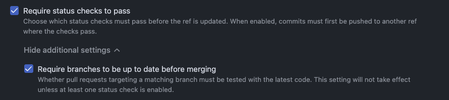
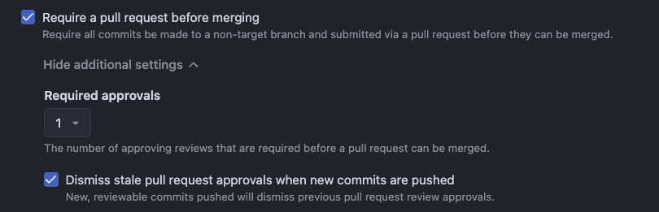
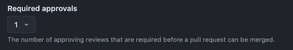

# Branch Rulesets

## Warnings

### `missing_non_fast_forward`

Solution: Enable the **Block force pushes** rule

### `missing_deletion`

Solution: Enable the **Restrict deletions** rule

### `mismatch_required_status_checks_strict_required_status_checks_policy`

Solution: Enable the **Require branches to be up to date before merging** rule

### `missing_pull_request`

Solution: Enable the **Require a pull request before merging** rule

### `mismatch_pull_request_dismiss_stale_reviews_on_push`

Solution: Enable the **Dismiss stale pull request approvals when new commits are pushed** rule

### `mismatch_pull_request_require_code_owner_review`

Solution: Enable the **Require review from Code Owners** rule

### `mismatch_pull_request_required_approving_review_count`

Solution: Ensure that the **Required approvals** setting is not `0`

### `missing_required_deployments`

Solution: Enable the **Require deployments to succeed** rule

