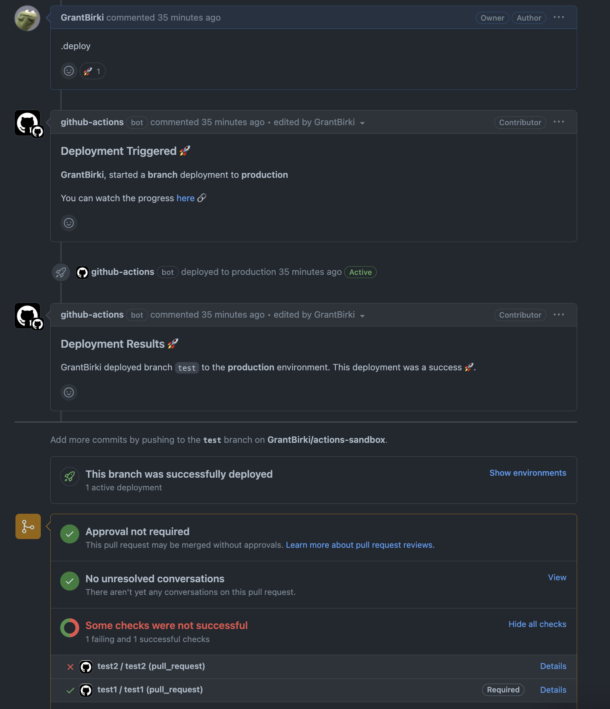
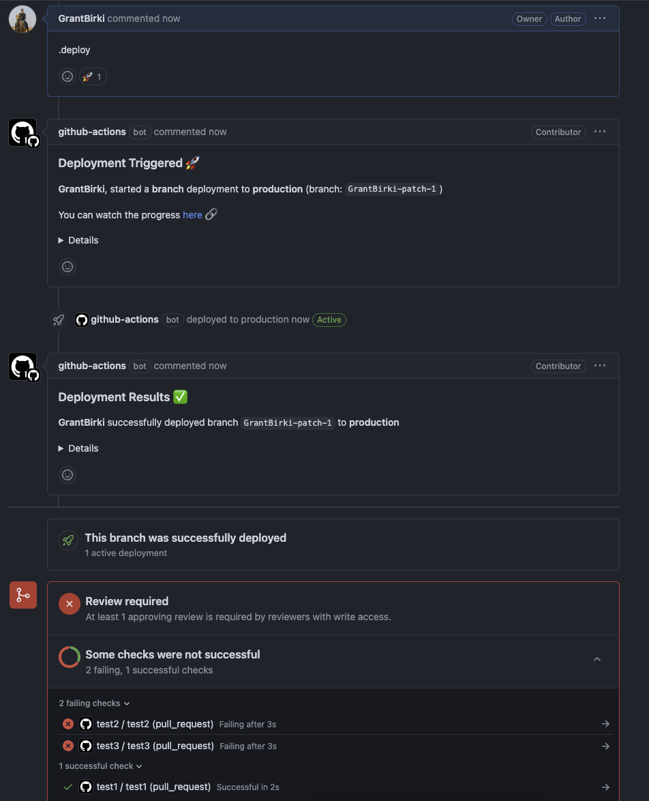
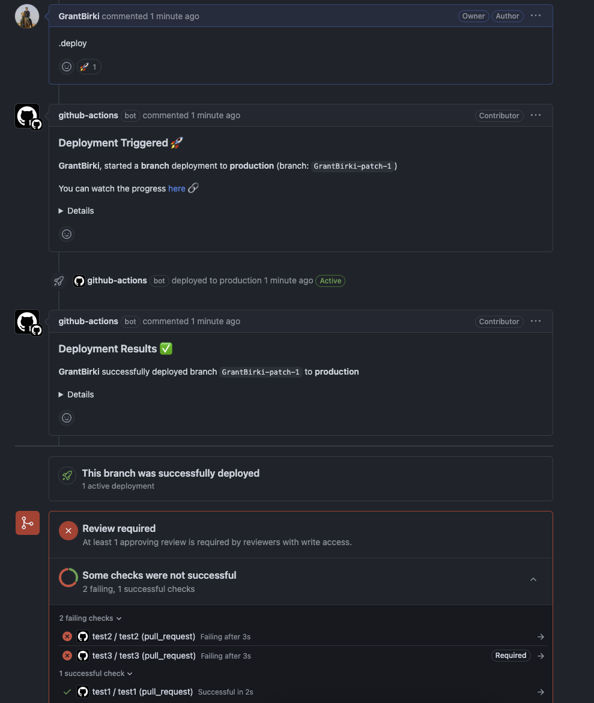

# Checks ✅

> This feature was originally requested via [#73](https://github.com/github/branch-deploy/issues/73) and further improved in [#321](https://github.com/github/branch-deploy/issues/321) and [#362](https://github.com/github/branch-deploy/issues/362)

The branch-deploy Action contains a useful input option to help give developers more control over how CI checks are handled during the deployment process. Some teams may have very strict controls over deployments and require **all status checks** to pass before a deployment can start. In this case, all CI checks must pass and that includes required, or non-required checks. Other teams may have a more relaxed approach and only require certain checks to pass before a deployment can start. This is where the `checks` input option comes in handy.

## Required CI Checks

First, let's explain what a "required" CI check is in case you're not familiar. A required CI check is a check that must pass before a pull request can be merged. This is a setting that can be configured in the repository settings under the "Branches" section. This section is shown in the screenshot below:


> This example came directly from this respository's settings

So in this particular repository, the following CI checks are required:

- `test`
- `package-check`
- `lint`
- `actions-config-validation`

Any other CI checks that run on a pull request are not required and are considered non-required checks.

## Using the `checks` Input Option

This section will contain a few examples of how you can use the `checks` option

### Example 1: All CI Checks Must Pass

This example shows how you can use the `checks` option to require all CI checks to pass before a deployment can start. This is the **default** behavior of the Action if you do not specify the `checks` option.

```yaml
- name: branch-deploy
  uses: github/branch-deploy@vX.X.X # replace with the latest version of this Action
  id: branch-deploy
  with:
    checks: "all" # all CI checks (required or not) must pass before a deployment can start to any environment
```

### Example 2: Only Required CI Checks Must Pass

This example shows how you can use the `checks` option to require only the **required** CI checks to pass before a deployment can start. This is useful if you have non-required checks that you don't want to block a deployment.

```yaml
- name: branch-deploy
  uses: github/branch-deploy@vX.X.X # replace with the latest version of this Action
  id: branch-deploy
  with:
    checks: "required" # only required CI checks must pass before a deployment can start to any environment
```

The screenshot below demonstrates how this option works in a real-world scenario. You can see how there are two CI checks defined on the pull request. One is called `test1` which is **required** and **passing**. The other is called `test2` which is **not required** and **failing**. Since the `checks` option is set to `required`, the deployment will start because the required check is passing and is the only status check taken into consideration for a deployment.



### Example 3: Only specific CI checks must pass (required or not)

If you only care about a specific CI check, you can use the `checks` option with a comma-separated list of checks that must pass. For example, if you only care about the `test1` check, you can do the following:

```yaml
- uses: github/branch-deploy@vX.X.X # replace with the latest version of this Action
  id: branch-deploy
  with:
    checks: 'test1' # we only care about the check named `test1`
```

This will require that a CI check named `test1` must pass before a deployment (to any environment) can start. If the `test1` check is in any state other than **passing** (successful), the deployment will not start. This option will scan all CI checks (required or not) and only the checks that are specified in the `checks` option will be considered are blocking for deployment. If you have 10 failing CI checks, and only one passing check, and that check is the only one specified in the `checks` option, the deployment will start.

Please note that just because you can _deploy_, doesn't always mean you can merge. You should always review the configuration options of this Action and the branch protection (or ruleset) polices within your repository and ensure that they are configured to meet your team's requirements.

> If you project has a lot of CI tests, no worries! You could do `test1,test2,<etc>` to specify multiple checks that must pass.



### Example 4: Only certain CI checks are ignored

```yaml
- uses: github/branch-deploy@vX.X.X # replace with the latest version of this Action
  id: branch-deploy
  with:
    ignored_checks: 'test2,test3' # these two checks are ignored and deployment will be allowed even if they are failing (and required)
```


