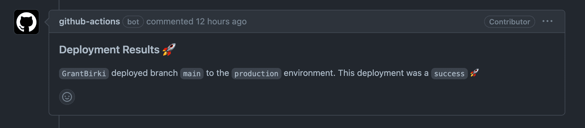

# Custom Deployment Messages ✏️

> This is useful to display to the user the status of your deployment. For example, you could display the results of a `terraform apply` in the deployment comment

There are two ways to add custom deployment messages to your PRs. You can either use a custom markdown file (suggested) or use the GitHub Actions environment to dynamically pass data to the post run workflow which will be rendered as markdown into a comment on your pull request.

## Custom Markdown File (suggested)

> This option is highly recommended over the latter "GitHub Actions Environment" option. This is because GitHub Actions has some limitations on the size of data that can be passed around in environment variables. This becomes an issue if your deployment message is large (contains many changes, think Terraform plan/apply) as your deployment will crash with an `Argument list too long` error.

To use a custom markdown file as your post deployment message, simply use the [`deploy_message_path`](https://github.com/github/branch-deploy/blob/37b50ea86202af7b5505b62bf3eb326da0614b60/action.yml#L124-L127) input option to point to a markdown file in your repository that you wish to render into the comment on your pull request. You don't even need to set this value if you want to just use the [default file path](https://github.com/github/branch-deploy/blob/37b50ea86202af7b5505b62bf3eb326da0614b60/action.yml#L127) of `".github/deployment_message.md"` and place your markdown file there.

If a markdown file exists at the designated path, it will be used and rendered with [nunjucks](http://mozilla.github.io/nunjucks/) which is a [Jinja](https://jinja.palletsprojects.com/en/3.1.x/) like template engine for NodeJS. Since we are using nunjucks and are leveraging template rendering, a few variables are available for you to use in your markdown file (should you choose to use them):

- `environment` - The name of the environment (String)
- `environment_url` - The URL of the environment (String) {Optional}
- `status` - The status of the deployment (String) - `success`, `failure`, or `unknown`
- `noop` - Whether or not the deployment is a noop (Boolean)
- `ref` - The ref of the deployment (String)
- `actor` - The GitHub username of the actor who triggered the deployment (String)

If you wish to see a live example of how this works, and how to use the variables, you can check out this [example](https://github.com/github/branch-deploy/blob/37b50ea86202af7b5505b62bf3eb326da0614b60/__tests__/templates/test_deployment_message.md) which is used in this repo's unit tests and is self-documenting.

Here is an example of what the final product could look like:



> To learn more about these changes you can view the pull request that implemented them [here](https://github.com/github/branch-deploy/pull/174)

## GitHub Actions Environment (not suggested)

> This option is not suggested as it comes with inherent limitations. See the "Custom Markdown File" section above for more information. It is highly recommended to use the custom markdown file option instead. However, if you are unable to use the custom markdown file option, this is an alternative

You can use the GitHub Actions environment to export custom deployment messages from your workflow to be referenced in the post run workflow for the `branch-deploy` Action that comments results back to your PR

Simply set the environment variable `DEPLOY_MESSAGE` to the message you want to be displayed in the post run workflow

Bash Example:

```bash
echo "DEPLOY_MESSAGE=<message>" >> $GITHUB_ENV
```

Actions Workflow Example:

```yaml
# Do some fake "noop" deployment logic here
- name: fake noop deploy
  if: ${{ steps.branch-deploy.outputs.continue == 'true' && steps.branch-deploy.outputs.noop == 'true' }}
  run: |
    echo "DEPLOY_MESSAGE=I would have **updated** 1 server" >> $GITHUB_ENV
    echo "I am doing a fake noop deploy"
```

## Additional Custom Message Examples 📚

### Adding newlines to your message

```bash
echo "DEPLOY_MESSAGE=NOOP Result:\nI would have **updated** 1 server" >> $GITHUB_ENV
```

### Multi-line strings ([reference](https://docs.github.com/en/actions/using-workflows/workflow-commands-for-github-actions#example-2))

```bash
echo 'DEPLOY_MESSAGE<<EOF' >> $GITHUB_ENV
echo "$SOME_MULTI_LINE_STRING_HERE" >> $GITHUB_ENV
echo 'EOF' >> $GITHUB_ENV
```

> Where `$SOME_MULTI_LINE_STRING_HERE` is a bash variable containing a multi-line string

### Adding a code block to your message

```bash
echo "DEPLOY_MESSAGE=\`\`\`yaml\nname: value\n\`\`\`" >> $GITHUB_ENV
```

## How does this work? 🤔

To add custom messages to our final deployment message we need to use the GitHub Actions environment. This is so that we can dynamically pass data into the post action workflow that leaves a comment on our PR. The post action workflow will look to see if this environment variable is set (`DEPLOY_MESSAGE`). If the variable is set, it adds to to the PR comment. Otherwise, it will use a simple comment body that doesn't include the custom message.
