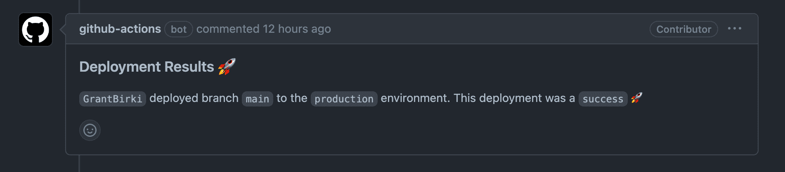

# Custom Deployment Messages ✏️

> This is useful to display to the user the status of your deployment. For example, you could display the results of a `terraform apply` in the deployment comment

Custom deployment messages use two building blocks that can be used separately or together: a trusted Markdown template and the `DEPLOY_MESSAGE` GitHub Actions environment variable. A template can render the `DEPLOY_MESSAGE` value with `{{ results }}`.

## Custom Markdown File (suggested)

> This option is recommended when you need trusted structure or additional deployment metadata. Dynamic results still pass through `DEPLOY_MESSAGE`, so large Terraform plan or apply output may need to be truncated, uploaded as an artifact, or replaced with a link to avoid environment-size limits.

Set [`deploy_message_path`](https://github.com/github/branch-deploy/blob/main/action.yml) to a repository-relative path such as `.github/deployment_message.md`. That path is also the default, so no input is needed when the template is stored there.

Branch Deploy does not read this path from the runner filesystem. In post mode it fetches the file through GitHub's Contents API from the current repository at the exact trusted workflow SHA saved during the main action. The path must be repository-relative and cannot contain absolute paths, backslashes, empty segments, `.` segments, or `..` traversal segments. If the file does not exist at that trusted SHA, Branch Deploy falls back to the default deployment message. Other fetch or validation failures stop the post action.

This keeps the template independent from any later checkout of pull request code. Scripts and other files executed by your workflow still need the protections described in the [trusted checkout hardening guide](trusted-checkouts.md).

### Supported template grammar

The v12 renderer intentionally supports a small, non-executable grammar instead of Nunjucks:

- `{{ variable }}` inserts an allowlisted variable.
- `...` tests a boolean variable.
- `...` negates that boolean test.
- `......` compares a variable with a literal. The operators `==`, `===`, `!=`, and `!==` are supported and all comparisons are strict; `==` does not coerce types.
- `{{ "value" if condition else "other" }}` selects between two literals. Variables are not allowed in the result branches.
- Conditional blocks can be nested.

Supported literals are double-quoted JSON strings, `true`, `false`, `null`, and JSON numbers. Filters, function calls, property access, loops, includes, macros, assignments, template comments, and arbitrary expressions are rejected.

For example:

```markdown
### Deployment {{ "succeeded" if status === "success" else "failed" }}

**{{ actor }}** deployed `{{ ref }}` to **{{ environment }}**.

[Open the environment]({{ environment_url }})

<details><summary>Results</summary>

{{ results }}

</details>
```

All runtime variables except `results` are HTML-escaped before insertion. `results` contains the `DEPLOY_MESSAGE` value and is inserted as raw Markdown so deployment output can contain formatting and code blocks. Rendering is single-pass: `{{ ... }}`, ``, or `{# ... #}` text inside `results` is emitted unchanged and is never evaluated as template syntax.

The following variables are available:

- `environment` - The name of the environment (String)
- `environment_url` - The URL of the environment (String) {Optional}
- `status` - The status of the deployment (String) - `success`, `failure`, or `unknown`
- `noop` - Whether or not the deployment is a noop (Boolean)
- `ref` - The ref of the deployment (String)
- `sha` - The sha of the deployment (String)
- `actor` - The GitHub username of the actor who triggered the deployment (String)
- `approved_reviews_count` - The number of approved reviews on the pull request at the time of deployment (Number or null)
- `review_decision` - The review status of the pull request (String or null) - Ex: `APPROVED`, `REVIEW_REQUIRED`, `CHANGES_REQUESTED`, `null` etc.
- `deployment_id` - The ID of the deployment (Int or null in the case of `.noop` deployments)
- `fork` - Whether or not the repository is a fork (Boolean)
- `params` - The raw string of deployment parameters (String)
- `parsed_params` - A string representation of the parsed deployment parameters (String)
- `deployment_end_time` - The time the deployment ended - this value is not _exact_ but it is very close (String) [ISO 8601](https://en.wikipedia.org/wiki/ISO_8601) UTC format
- `logs` - The URL to the logs of the deployment (String)
- `commit_verified` - Whether or not the commit was verified (Boolean)
- `total_seconds` - The total number of seconds the deployment took to complete (Number)
- `results` - The raw deployment result from `DEPLOY_MESSAGE` (String)

Here is an example of what the final product could look like:



## Environment-Only Message (not suggested)

> `DEPLOY_MESSAGE` is how deployment steps provide dynamic results in both approaches. This section covers using that value without a custom Markdown template, which provides less control over the final comment. Prefer the trusted template above when you need custom structure or additional deployment metadata.

You can use the GitHub Actions environment to export custom deployment messages from your workflow to be referenced in the post run workflow for the `branch-deploy` Action that comments results back to your PR

Simply set the environment variable `DEPLOY_MESSAGE` to the message you want to be displayed in the post run workflow

Bash Example:

```bash
printf '%s\n' 'DEPLOY_MESSAGE=<message>' >> "$GITHUB_ENV"
```

Actions Workflow Example:

```yaml
# Do some fake "noop" deployment logic here
- name: fake noop deploy
  if: ${{ steps.branch-deploy.outputs.continue == 'true' && steps.branch-deploy.outputs.noop == 'true' }}
  run: |
    printf '%s\n' 'DEPLOY_MESSAGE=I would have **updated** 1 server' >> "$GITHUB_ENV"
    echo "I am doing a fake noop deploy"
```

## Additional Custom Message Examples 📚

### Adding newlines to your message

```bash
printf '%s\n' 'DEPLOY_MESSAGE=NOOP Result:\nI would have **updated** 1 server' >> "$GITHUB_ENV"
```

### Multi-line strings ([reference](https://docs.github.com/en/actions/using-workflows/workflow-commands-for-github-actions#example-2))

```bash
delimiter="branch_deploy_$(od -An -N16 -tx1 /dev/urandom | tr -d ' \n')"
while printf '%s\n' "$SOME_MULTI_LINE_STRING_HERE" | grep -Fxq "$delimiter"; do
  delimiter="branch_deploy_$(od -An -N16 -tx1 /dev/urandom | tr -d ' \n')"
done
{
  printf 'DEPLOY_MESSAGE<<%s\n' "$delimiter"
  printf '%s\n' "$SOME_MULTI_LINE_STRING_HERE"
  printf '%s\n' "$delimiter"
} >> "$GITHUB_ENV"
```

> Where `$SOME_MULTI_LINE_STRING_HERE` is a bash variable containing a multi-line string

### Adding a code block to your message

```bash
printf '%s\n' 'DEPLOY_MESSAGE=```yaml\nname: value\n```' >> "$GITHUB_ENV"
```

## How does this work? 🤔

To add dynamic results to the final deployment message, write `DEPLOY_MESSAGE` through the GitHub Actions environment. The post action reads that value when it leaves the pull request comment. If a trusted template exists, the value is available as `{{ results }}`; otherwise, Branch Deploy includes it in the standard comment. When the variable is unset, the standard comment does not include custom results.
