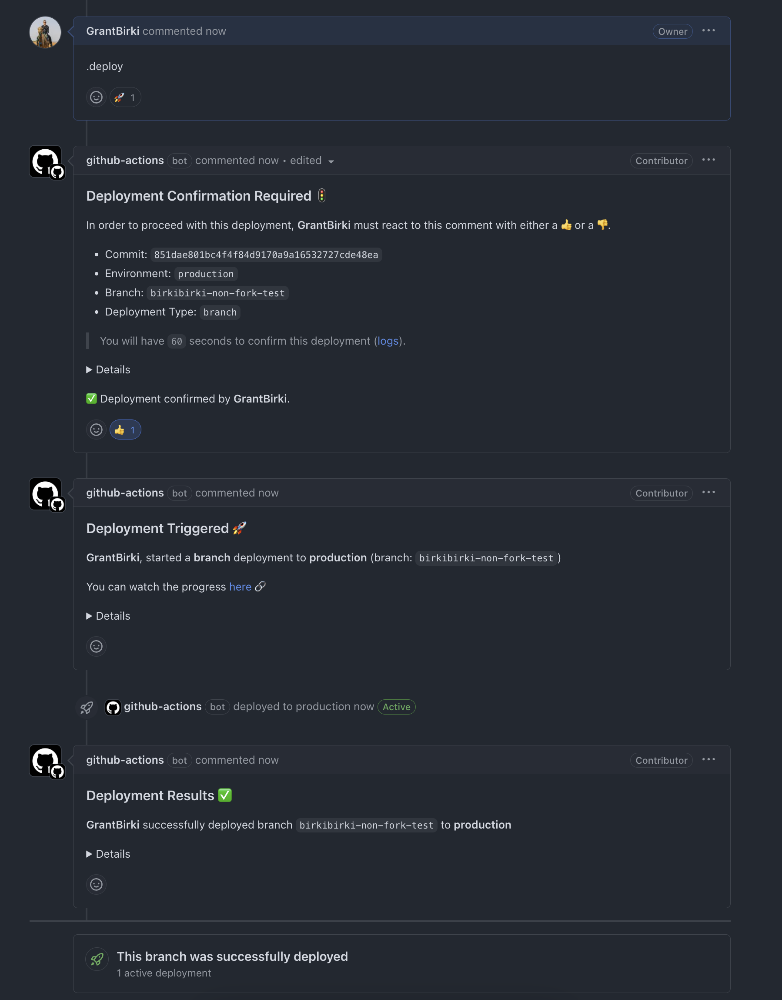
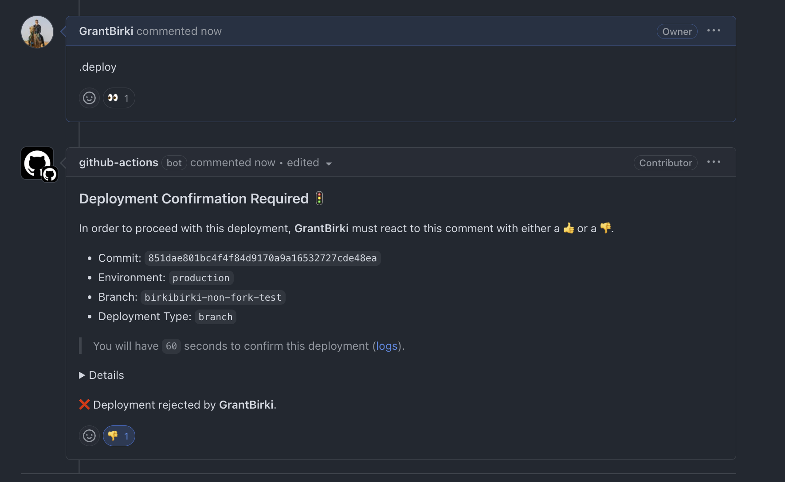
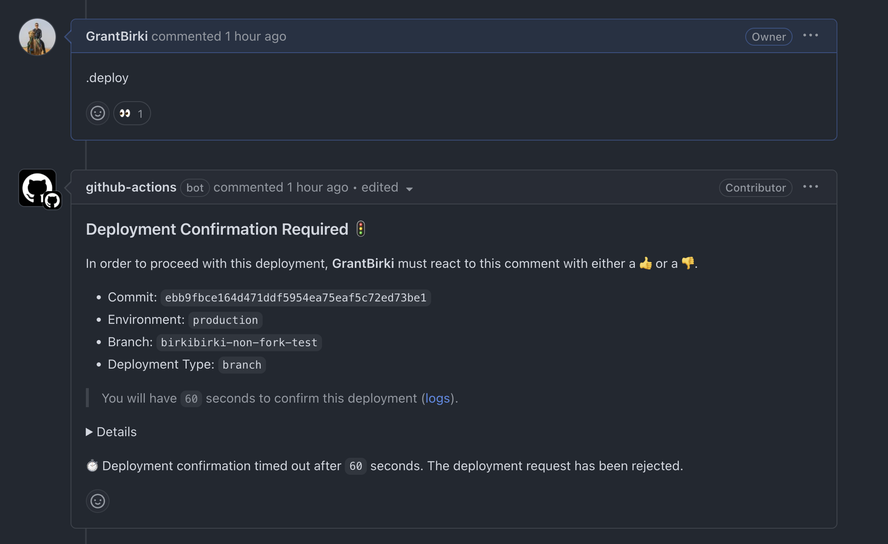

# Deployment Confirmation

## Overview

For projects that require the highest level of deployment safety/security, the branch-deploy Action can be configured to require a deployment **confirmation** before a deployment is allowed to proceed.

This can be considered a "final safety check" before a deployment can continue.

By using this feature, it is also an extremely effective way to prevent accidental or malicious commits from being deployed without first having one last safety review. This is important for hardening against Actions related [TOCTOU](https://github.com/AdnaneKhan/ActionsTOCTOU) vulnerabilities.

## How it works

When a user invokes a deployment via the `.deploy` (or `.noop`) command, the branch-deploy Action will pause _just_ before the final call to start a deployment by this Action. The Action will then create a new comment on the pull request that invoked the deployment, asking the user to confirm (or reject) the deployment.

This comment will provide the user with a summary of the deployment that is **about** to be run. The user will then have the opportunity to confirm (with a 👍) or deny (with a 👎) the deployment.

Depending on the user's response (or lack of response), the branch-deploy Action will update the comment with the outcome.

The only reaction (👍 or 👎) that will be considered is the first reaction from the original actor that invoked the deployment (via `.deploy`). For example, if `@monalisa` comments `.deploy`, only `@monalisa` can give deployment confirmation via a reaction. All other reactions will be ignored on the deployment confirmation comment.

### Usage

```yaml
      - uses: github/branch-deploy@vX.X.X
        id: branch-deploy
        with:
          trigger: ".deploy"
          deployment_confirmation: true # <-- enables deployment confirmation
          deployment_confirmation_timeout: 60 # <-- sets the timeout to 60 seconds
```

### Confirming a Deployment 👍

If the user confirms the deployment, the deployment will proceed as normal:



### Rejecting a Deployment 👎

If the user rejects the deployment, the branch-deploy Action will immediately exit and the `continue` output will not be set to `true`. This will prevent the deployment from proceeding.



### Timing Out 🕒

If the user does not respond within a set amount of time (configurable, but defaults to 1 minute), the deployment will be automatically rejected. The user will be notified of this outcome.



## Demo 📹

View a [demo video](https://github.com/github/branch-deploy/pull/374) of a deployment confirmation in action on the original pull request that introduced this feature.
