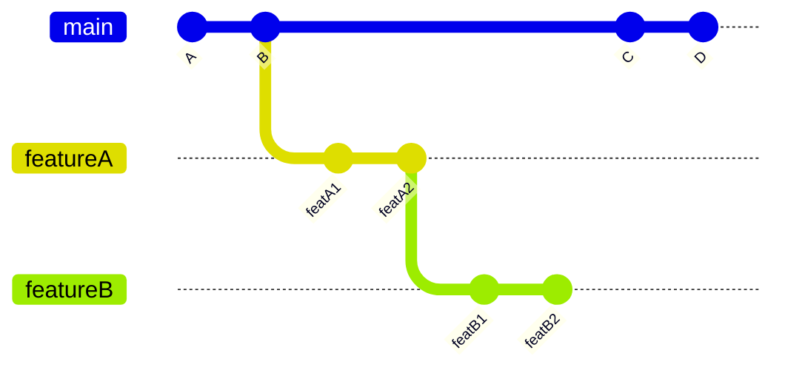
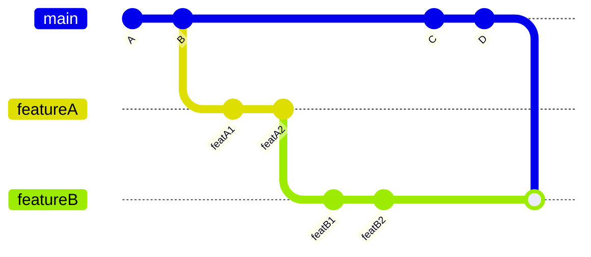
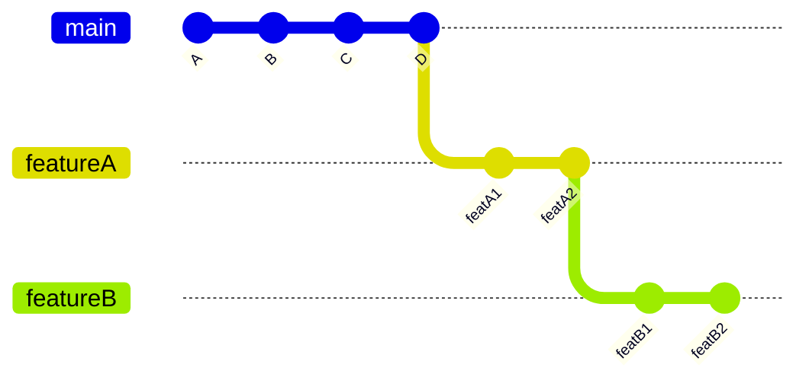

# Outdated Mode

> Issue [#253](https://github.com/github/branch-deploy/issues/235) contains a great discussion about the outdated mode and why it was added as a feature to this project.

The `outdated_mode` input option gives you the ability to determine how the branch-deploy Action should handle outdated branches. This input option is closely related to the `update_branch` input option as well.

## Using the `outdated_mode` input option

The `outdated_mode` input option has three possible values:

- `strict` (default): The branch-deploy Action will consider your branch (that you are deploying) to be out-of-date if it is behind the default|stable branch (i.e `main`) or if it is behind the branch that your pull request is merging into.
- `pr_base`: The branch-deploy Action will consider your branch (that you are deploying) to be out-of-date if it is behind the branch that your pull request is merging into.
- `default_branch`: The branch-deploy Action will consider your branch (that you are deploying) to be out-of-date if it is behind the default|stable branch (i.e `main`). The `default_branch` is determined by the value you have set for the `stable_branch` input option. By default, the value of the `stable_branch` input option is `main`.

### How the `outdated_mode` input option works with the `update_branch` input option

If your branch is determined to be out-of-date, the branch-deploy Action will not deploy your branch. What happens next is determined by the value of the `update_branch` input option. Here are the three possible values for the `update_branch` input option and how they will operate:

- `warn`: The branch-deploy Action will leave a comment on your pull request indicating that your branch is out-of-date and that you should update it before it can be deployed.
- `force`: The branch-deploy Action will attempt to update your branch by merging the latest commits into your branch for you. You will need to re-run the deployment command after the branch-deploy Action has attempted to update your branch.
- `disabled`: The branch-deploy Action will allow you to deploy your branch even if it is out-of-date. (dangerous)

It should be noted that if you are using the `force` value for the `update_branch` input option, the branch-deploy Action will only attempt to update your branch with the target base branch of the pull request. This means that if your target base branch is something other than the default|stable branch, the branch-deploy Action will only attempt to update your branch with the latest commits from the target base branch. You will still be warned about your branch being out-of-date with the default|stable branch but it will not try to update your branch with the latest commits from the default|stable branch due to the complexity and potential risk involved with such a merge. You will need to manually update your branch with the latest commits from the default|stable branch if you want to deploy your branch and that is the case.

## About the `outdated_mode` input option

The `outdated_mode` input option is useful when you want to ensure that the branch-deploy Action only deploys branches that are up-to-date. This is especially useful when you have a large team of developers working on a project and you want to ensure that commits are not rolled back accidentally when you are deploying a branch. For the sake of availability and deployment confidence, this input option is set to `strict` by default. This will ensure that your branch is up-to-date with the latest commits from both the default|stable branch and the branch that your pull request is merging into.

## Example Scenarios

This section will go into a few example scenarios to help you understand how the `outdated_mode` input option works in practice.

> Big thanks to @jessew-albert for providing these examples!

### Scenario 1

This example diagram shows a scenario where a branch is created from the default|stable branch (`main` in this case). The name of this branch is `featureA` and a following branch is created from `featureA` called `featureB`. A few commits are made to the `featureB` branch and sometime later, another developer merges two commits into `main`. The `featureB` branch is now out-of-date with `main` even though it is up-to-date with the `featureA` branch. In this example, the target base branch of `featureB` is `featureA`.

Let's pretend that we are trying to run the `.deploy` command on the pull request associated with `featureB` (which is trying to merge into `featureA`).

- If the `outdated_mode` input option is set to `strict`, the branch-deploy Action will consider the `featureB` branch to be out-of-date and prevent the deployment from happening. This is because the `featureB` branch is behind the `main` branch. If this branch were to be deployed, it would roll back the commits made to `main` and that could cause issues. Even though the `featureB` branch is up-to-date with the `featureA` branch, it is still considered out-of-date because it is behind the `main` branch when the `outdated_mode` input option is set to `strict`.
- If the `outdated_mode` input option is set to `pr_base`, the branch-deploy Action will consider the `featureB` branch to be up-to-date and allow the deployment to happen. This is because the `featureB` branch is up-to-date with the `featureA` branch. The `featureB` branch is behind the `main` branch but that is not relevant in this case because the target base branch of the pull request is `featureA` and not `main`.
- If the `outdated_mode` input option is set to `default_branch`, the branch-deploy Action will consider the `featureB` branch to be out-of-date and prevent the deployment from happening. This is because the `featureB` branch is behind the `main` branch. If this branch were to be deployed, it would roll back the commits made to `main` and that could cause issues. Even though the `featureB` branch is up-to-date with the `featureA` branch, it is still considered out-of-date because it is behind the `main` branch when the `outdated_mode` input option is set to `default_branch`.

### Scenario 2

This scenario shows the "ideal" situation for a successful deployment. In this example, the `featureB` branch is up-to-date with both the `featureA` branch and the `main` branch. When this is the case, it does not matter which value you have set for the `outdated_mode` input option. Whether you have it set to `strict`, `pr_base`, or `default_branch`, all options in this case are up-to-date and the branch-deploy Action will allow the deployment to happen. Hooray!

This diagram expands upon [Scenario 1](#scenario-1) and shows the `featureB` branch being updated by having `main` merged into it:

Alternatively, you could rebase the stack with `featureA` and `featureB` on top of `main`:

