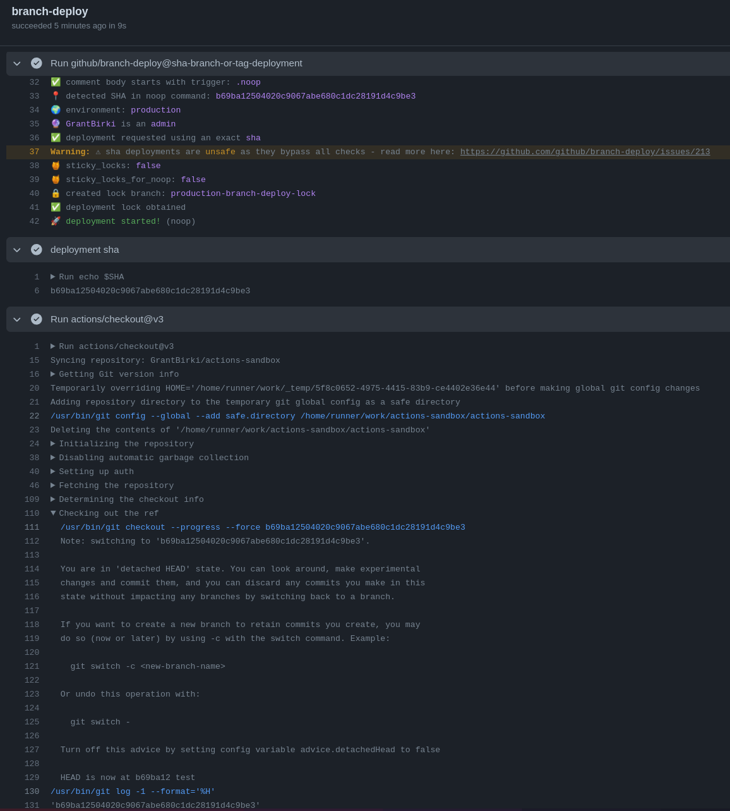

# Unsafe SHA Deployments

The following pull request [#212](https://github.com/github/branch-deploy/pull/212) enables users to use the branch-deploy Action to deploy an **exact** SHA1 or SHA256 hash instead of a branch. While this feature can be incredibly useful or even [necessary for some projects](https://github.com/github/branch-deploy/issues/211#issue-1924462155), it can be dangerous and unsafe.

By enabling the `allow_sha_deployments` input option, you can enable SHA deployments for your project, but you should be aware of the risks.

SHA deployments allow you to deploy an **exact** SHA instead of the branch associated with your pull request. This means that you can deploy a commit that is not associated with a pull request, or even a commit that is associated with another user's pull request.

Here is an example:

```text
.deploy b69ba12504020c9067abe680c1dc28191d4c9be3 to production
```

## Why is this option dangerous / unsafe?

Before we start, let's first take a look at how SHA1/256 hashes are used in Git. Branches, tags, and commits, all point to a "SHA" under the hood. So think of a branch / tag as a friendly name to point to a SHA at a certain point in time.

When using the branch-deploy Action in its default configuration, a user is typically either deploying a **branch** associated with a pull request, or they are deploying `main` (the main or default branch) in a rollback should something go wrong.

Branches can be associated with CI checks, and approvals. The `main` (or default) branch can be associated with branch protection rules and we can often assume that changes only land on `main` once they have gone through the proper pull request process.

Now pulling together all the statements above... what does this tell us about deploying a given SHA? It _can be_ incredibly risky. A user could comment `.deploy <sha>` on their pull request and deploy a commit attached to _another user's_ pull request that has not been approved or tested. This could potentially allow for malicious or broken code to be deployed.

Since a given SHA could originate from **anywhere** in a given Git project, we can't reliably check if CI passed or if approvals were given for the SHA in question.

Given all of the above, it is clear that deploying SHAs could potentially be unsafe if you are unfamiliar with the actions being taken by this style of deployment

## My project structure requires SHA deployments, what should I do?

Just because SHA deployments _can be unsafe_  doesn't mean that they _will be unsafe_.

For example, if you:

- Understand the risks
- Have proper and restricted repo permissions for your collaborators (i.e. the whole company doesn't have `write` access to deploy)
- Trust your collaborators
- Have a well defined rollback process

Then you can properly evaluate the risk of enabling this deployment option.

## Enabling SHA Deployments

In order to use this feature, you must set the following input option:

```yaml
- uses: github/branch-deploy@vX.X.X
  id: branch-deploy
  with:
    allow_sha_deployments: "true" # <--- this option must be "true"
```

The reasoning for this is that SHA deployments can easily become dangerous. So users should be informed, and have to manually enable this feature for it to be used.

### Example 📸

Once you have enabled SHA deployments, you should see some output similar to this example to know that it is working properly.


